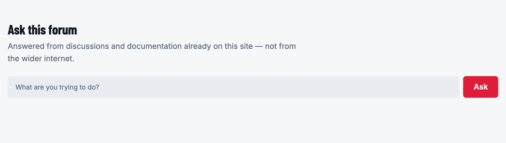
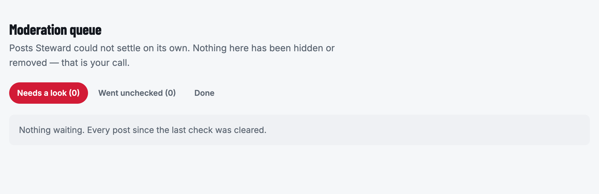
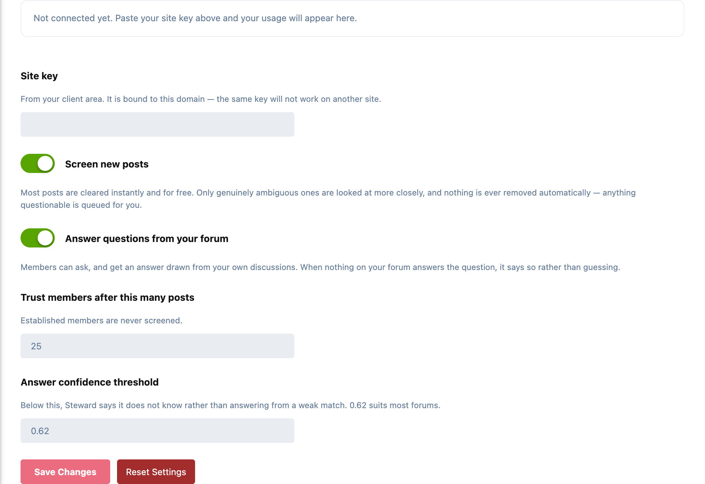

# Steward

Hosted AI for Flarum — **answers drawn from your own forum**, and **moderation
that reads a post before it flags it**. No AI account, no API key, no per-token
bill.

Distinct from **AI Helper**, which stays bring-your-own-key for people who want
to run their own model. Steward is sold as capacity through the client area and
adds moderation.



---

## What it does

### Answers, with sources

A member asks a question and gets an answer assembled from discussions already
on your site — with **every source cited**, so it can be checked rather than
trusted.

When nothing on the forum answers the question it says so. It does not reach out
to the wider internet, and it does not invent something plausible to fill the
gap. An answer you cannot trace back to a real post is worse than no answer.

Retrieval runs against your forum's own search, or — on plans that include it —
against a hosted semantic index, so answers are found by meaning rather than
keyword overlap.

Members ask at `/ask`.

### Moderation, that never deletes

Every new post is read before it lands. Most are cleared instantly and for
nothing; only genuinely ambiguous ones are looked at more closely.

- **Nothing is ever removed automatically.** The strongest outcome is "a person
  should look at this". Software that reads a post decides what a moderator
  *looks at*, never what disappears.
- **Every non-clear verdict carries reasons in plain words.** A queue you cannot
  read is a queue you cannot trust or tune.
- **Trusted members are never screened.** Spending money to second-guess someone
  who has posted politely for three years is worse than useless.
- **CSAM escalates** rather than being handled inline.
- **A moderation outage is not a posting outage.** If the service is
  unreachable, posts publish and are marked unscreened rather than blocked.

Flagged posts land in a review queue on your forum at `/moderation/queue`, for
whoever holds the `steward.review` permission.



- **Needs a look:** posts Steward could not settle on its own, with its reasons.
- **Went unchecked:** posts published without screening because the allowance
  ran out or the service was unreachable. Not suspicious, just the window nobody
  checked.
- **Done:** what has already been dealt with.

### Usage where you will actually look

Your consumption, and what is left of it, appear in **Steward's own settings
page** — not on a billing portal you have to remember to visit. It shows the
daily trend, not just a total, because "60% used" does not tell you whether you
are about to run out.

---

## Settings

Admin → Steward:



- **Site key:** from your client area, bound to this domain.
- **Screen new posts:** moderation on or off.
- **Answer questions from your forum:** the Ask page on or off.
- **Trust members after this many posts:** members past this count are never screened. 25 by default.
- **Answer confidence threshold:** below this, Steward says it does not know rather than answering from a weak match. 0.62 by default, which suits most forums.

Your usage panel sits at the top of the same page once the key is in.

---

## Install

```bash
composer require ernestdefoe/steward
php flarum migrate
php flarum cache:clear
```

Enable it, then paste your site key into its settings. The key is bound to one
domain and re-checked on every request, so it cannot be used anywhere else.

Requires **Flarum 2.0** and PHP 8.3+. A subscription is required:
<https://ernestdefoe.online/account>

## Updating

```bash
composer update ernestdefoe/steward
php flarum migrate
php flarum cache:clear
```

Updating from 1.0.2 or earlier: run this once. Those versions indexed posts in
staff-only or restricted tags and posts awaiting approval; this removes them from
the hosted index (public posts are left alone).

```bash
php flarum steward:withdraw-restricted
```

---

## Your data

Only **public** content is ever sent: what a signed-out visitor can read. Posts
in private, hidden or restricted-tag discussions, hidden posts and posts awaiting
approval are never indexed, and a post that stops being public (moved to a
restricted tag, made private, hidden) is withdrawn from the index rather than
left behind.

With your own OpenSearch index, every passage that is a forum post is checked
against the member asking before it is answered from or cited, so nobody is
answered from a thread they cannot open. For that check, index documents should
carry a `postId` field or a `/d/<id>-<slug>/<number>` link in `url`.

On hosted retrieval your index is yours alone, and is **deleted when you
cancel** — on the same call that ends the service, not in a cleanup job somebody
remembers to run.

---

## Why the pre-filter exists

Moderation runs on every post, unlike an assistant which runs when someone asks.
A forum posting 500 times a day is 15,000 screenings a month; sending all of
them to a model costs more than the subscription — on precisely the busy forums
that need moderation most.

`Moderation\PreFilter` clears the obviously-fine majority for nothing and
escalates only what is genuinely ambiguous. Measured against 486 real posts:

| | share |
|---|---|
| Cleared free | 99.4% |
| Escalated to the model | 0.6% |

Among **untrusted** posters only — the population it actually inspects — the
escalation rate is 9.7%. Even on a forum where every poster is a newcomer that
is roughly $0.51 per 15,000 posts against $5.25 with no pre-filter.

---

## Support

- **Support site:** [ernestdefoe.online](https://ernestdefoe.online)
- **Issues:** [github.com/ernestdefoe/steward/issues](https://github.com/ernestdefoe/steward/issues)

## License

Proprietary — commercial license. © 2026 ernestdefoe.
